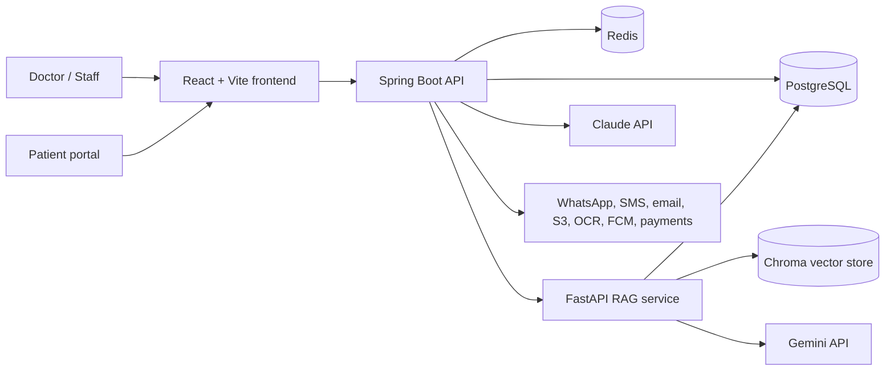

# Shifa

Patient visit management for clinics that need structured records, AI-assisted summaries, multilingual patient access, and follow-up workflows in one place.

Shifa is a full-stack healthcare platform built around the doctor-patient visit lifecycle: registering doctors and patients, recording visits, storing clinical documents, generating visit summaries, sending patient-facing updates, and answering patient questions from indexed medical context. It combines a Spring Boot API, a React clinician/patient portal, PostgreSQL-backed records, Redis-backed workflow support, and a separate FastAPI RAG service for document and chat intelligence.

[](https://github.com/Saadmadni84/Shifa/actions/workflows/ci.yml)


## Demo / Screenshot

Add a product GIF or screenshots here once the app is running locally. Useful captures:

- Doctor dashboard with patient and visit summaries
- New visit flow with AI processing status
- Patient portal visit summary
- RAG chat answering a question from indexed documents

## Key Features

- Gives doctors a single workspace for patients, visits, prescriptions, vitals, documents, reminders, notifications, and dashboard stats.
- Converts visit notes and uploaded context into patient-facing summaries through AI-backed processing flows.
- Provides patient portal routes for health records, visit summaries, vitals, and chat-based Q&A.
- Stores clinical data in PostgreSQL with Flyway migrations and validates the schema at application startup.
- Supports operational integrations already represented in code: WhatsApp Cloud API, SMS, email, S3 document storage, OCR, FCM, ABDM, DeepL, Razorpay, and Claude.
- Runs as separate frontend, backend, and RAG services so the core clinical API can evolve independently from vector search and ingestion.

## Architecture



The React frontend uses a shared Axios client with JWT attachment, token refresh, network retry, and normalized error handling. The Spring Boot backend owns authentication, clinical domains, persistence, schedulers, audit hooks, and external integrations. Flyway applies database migrations under `backend/src/main/resources/db/migration`. The RAG service indexes patient records and uploaded PDFs/audio into Chroma, retrieves relevant chunks, and generates chat responses with Gemini.

## Tech Stack

| Category | Technology | Why it was chosen |
| --- | --- | --- |
| Frontend | React 18, Vite 5 | Fast local development and component-based clinician/patient workflows. |
| Frontend state/data | Zustand, TanStack Query, Axios | Lightweight client state plus request caching and a centralized API client. |
| Styling | Tailwind CSS, lucide-react, Recharts | Utility-first UI, consistent icons, and charting for vitals/dashboards. |
| Backend API | Java 17, Spring Boot 3.2.4 | Mature web, validation, security, scheduling, and integration support. |
| Persistence | PostgreSQL, Spring Data JPA, Flyway | Relational clinical records with explicit schema migrations. |
| Cache/workflow support | Redis | Token/workflow support and scheduler-adjacent infrastructure. |
| Backend mapping | MapStruct, Lombok | Less DTO boilerplate while keeping typed Java APIs. |
| AI services | Claude integration, FastAPI RAG, Gemini, Chroma | Summary generation in the Java API and document-grounded chat in the Python service. |
| Files/OCR | S3 SDK, Tess4J, PDFBox | Document upload, storage, and text extraction paths are implemented in the backend. |
| Deployment | Docker Compose, Kubernetes manifests, GitHub Actions | Local infrastructure, deployable manifests, and CI checks are included. |

## Getting Started

### Prerequisites

- Java 17
- Maven 3.9+
- Node.js 20 and npm
- Python 3.11 or 3.12 recommended for the RAG service
- Docker Desktop or Docker Engine with Compose
- PostgreSQL and Redis, or the provided Docker Compose services

### 1. Clone the repository

```bash
git clone https://github.com/Saadmadni84/Shifa.git
cd Shifa
```

### 2. Start local infrastructure

```bash
docker compose -f docker/docker-compose.yml up -d
```

This starts:

- PostgreSQL on `localhost:5432`
- Redis on `localhost:6379`
- Adminer on `http://localhost:8081`

The development backend profile expects:

```text
database: shifa_db
username: postgres
password: password
```

### 3. Configure environment variables

There is no `.env.example` in the repository yet. The application has development defaults for many integrations, but real external services require environment variables.

Common backend variables:

```bash
export JWT_SECRET="replace-with-a-long-random-secret"
export CLAUDE_API_KEY="your-anthropic-key"
export WHATSAPP_TOKEN="your-whatsapp-token"
export WHATSAPP_PHONE_NUMBER_ID="your-phone-number-id"
export TWILIO_ACCOUNT_SID="your-twilio-sid"
export TWILIO_AUTH_TOKEN="your-twilio-token"
export RAG_BASE_URL="http://localhost:5050"
```

Common RAG variables:

```bash
export DB_HOST="localhost"
export DB_PORT="5432"
export DB_NAME="shifa_db"
export DB_USER="postgres"
export DB_PASSWORD="password"
export GEMINI_API_KEY="your-gemini-key"
export CHROMA_DB_PATH="./chroma_db"
```

Frontend API base URL:

```bash
export VITE_API_BASE_URL="http://localhost:8080/api"
```

### 4. Run the backend

```bash
cd backend
mvn spring-boot:run
```

The backend runs on `http://localhost:8080`. Flyway runs automatically on startup.

Useful endpoints:

- `http://localhost:8080/actuator/health`
- `http://localhost:8080/swagger-ui/index.html`

### 5. Run the frontend

In a second terminal:

```bash
cd frontend
npm ci
npm run dev
```

The Vite development server runs on `http://localhost:5173` by default.

### 6. Run the RAG service

In a third terminal:

```bash
cd backend/rag-service2
python3 -m venv .venv
source .venv/bin/activate
pip install -r requirements.txt
uvicorn app:app --reload --host 0.0.0.0 --port 5050
```

RAG service docs are available at `http://localhost:5050/docs`.

## API Reference / Usage Examples

The Spring Boot API exposes OpenAPI documentation at:

```text
http://localhost:8080/swagger-ui/index.html
```

Representative backend routes from the controllers:

| Area | Method | Route |
| --- | --- | --- |
| Auth | `POST` | `/api/auth/register` |
| Auth | `POST` | `/api/auth/login` |
| Auth | `POST` | `/api/auth/refresh` |
| Patients | `POST` | `/api/patients` |
| Patients | `GET` | `/api/patients/{id}` |
| Patients | `GET` | `/api/patients/search` |
| Visits | `POST` | `/api/visits` |
| Visits | `POST` | `/api/visits/{id}/process` |
| Visits | `POST` | `/api/visits/{id}/send` |
| Portal | `GET` | `/api/portal/{token}/summary` |
| Documents | `POST` | `/api/documents/upload` |
| Notifications | `GET` | `/api/notifications/unread-count` |

RAG service examples:

```bash
curl http://localhost:5050/api/v1/health
```

```bash
curl -X POST http://localhost:5050/api/v1/chat \
  -H "Content-Type: application/json" \
  -d '{
    "session_id": "demo-session",
    "question": "What medications were discussed in the latest visit?"
  }'
```

```bash
curl -X POST http://localhost:5050/api/v1/ingest/pdf \
  -F "file=@/path/to/report.pdf" \
  -F "patient_id=patient-123" \
  -F "session_id=session-123"
```

## Project Structure

```text
.
|-- backend/
|   |-- pom.xml                         # Spring Boot dependencies and build config
|   |-- src/main/java/com/shifa/        # Java API, domains, security, integrations, schedulers
|   |-- src/main/resources/             # Spring config, Flyway migrations, i18n messages, prompts
|   |-- src/test/                       # Backend integration tests
|   `-- rag-service2/                   # FastAPI RAG, ingestion, vector search, and tests
|-- frontend/
|   |-- package.json                    # Vite scripts and frontend dependencies
|   |-- src/api/                        # Axios client and API modules
|   |-- src/components/                 # Shared UI, doctor, patient, visit, chart components
|   |-- src/pages/                      # Doctor, patient, portal, auth, and demo pages
|   |-- src/router/                     # Route definitions and route helpers
|   |-- src/store/                      # Zustand stores
|   `-- src/i18n/                       # i18next setup and locale files
|-- docker/
|   |-- docker-compose.yml              # Local PostgreSQL, Redis, and Adminer
|   |-- docker-compose.prod.yml         # Production-oriented compose file
|   `-- Dockerfile                      # Container build file
|-- k8s/                                # Kubernetes deployment, service, ingress, secrets manifests
|-- docs/                               # Existing API, architecture, and database notes
`-- .github/workflows/                  # CI and placeholder deployment workflow
```

## RAG Research & Evaluation

Beyond the application itself, `backend/rag-service2/evaluation/` is a
self-contained **retrieval & generation research harness**: a 195-question
medical QA benchmark (80 educational documents), BM25 / dense / hybrid (RRF)
retrievers, token-based chunking, standard IR metrics (Recall@K, Precision@K,
MRR, nDCG), and generation metrics (faithfulness, hallucination rate, answer
and context relevance).

```bash
cd backend/rag-service2
python -m evaluation.run_evaluation     # runs all 4 experiments → results/report.md
python -m pytest evaluation/tests -q    # 31 unit tests, offline
```

Experiments compare retrieval methods, embedding models, and chunk sizes
(256/512/768/1024 tokens), and evaluate the generation stage separately.
Latest committed results: [`backend/rag-service2/evaluation/results/report.md`](backend/rag-service2/evaluation/results/report.md).
Methodology and honest framing notes: [`backend/rag-service2/evaluation/README.md`](backend/rag-service2/evaluation/README.md).

## Testing

Backend tests:

```bash
cd backend
mvn test
```

Verified locally: `mvn -q test` completed successfully.

Frontend build:

```bash
cd frontend
npm ci
npm run build
```

Verified locally: `npm run build` completed successfully. Vite reported a large chunk warning and an outdated Browserslist database warning; both are warnings, not build failures.

Frontend tests:

```bash
cd frontend
npm test -- --run
```

Current status: Vitest is configured, but no `*.test.*` or `*.spec.*` files exist, so the command exits with code `1`.

RAG service tests:

```bash
cd backend/rag-service2
python3 -m venv .venv
source .venv/bin/activate
pip install -r requirements.txt
python -m pytest -q
```

Current local note: running `python3 -m pytest -q` without installing `requirements.txt` fails during collection because dependencies such as FastAPI, LangChain, Chroma, and psycopg2 are missing.

CI:

- `.github/workflows/ci.yml` builds the backend with `mvn -B clean verify`.
- `.github/workflows/ci.yml` installs and builds the frontend with `npm ci` and `npm run build`.
- `.github/workflows/deploy.yml` is currently a manual placeholder.

## Roadmap

- Add `.env.example` files for backend, frontend, and RAG service so local setup does not depend on reading source config.
- Add frontend component and route tests for the doctor dashboard, patient portal, and authentication flows.
- Add container orchestration for the RAG service alongside PostgreSQL and Redis in local Docker Compose.
- Replace the placeholder deploy workflow with a real target environment and documented release steps.

## Contributing

Contributions are welcome. Keep changes focused, include tests for behavior changes, and update documentation when commands, routes, configuration, or workflows change.

Suggested workflow:

```bash
git checkout -b feature/short-description
# make changes
cd backend && mvn test
cd ../frontend && npm run build
git commit -m "Describe the change"
```

Open a pull request against `main` with a concise description, screenshots for UI changes, and any setup notes reviewers need.

## License

No license file is present in this repository. Until a license is added, all rights are reserved by the repository owner by default.

## Contact / Author

Built by [Saad Madni](https://github.com/Saadmadni84).

Repository: [github.com/Saadmadni84/Shifa](https://github.com/Saadmadni84/Shifa)
